# military Museum

This program creates a military museum

## result

### video

### screenshot

Start the process on the aircraft carrier

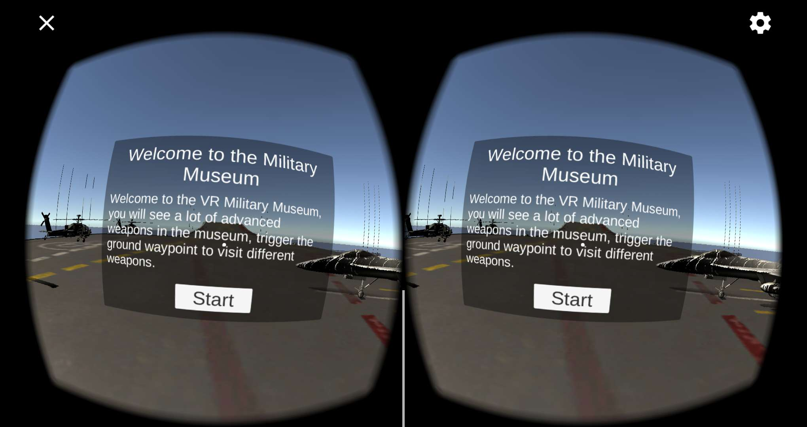

At this time look around and found that in the spectacular aircraft carrier

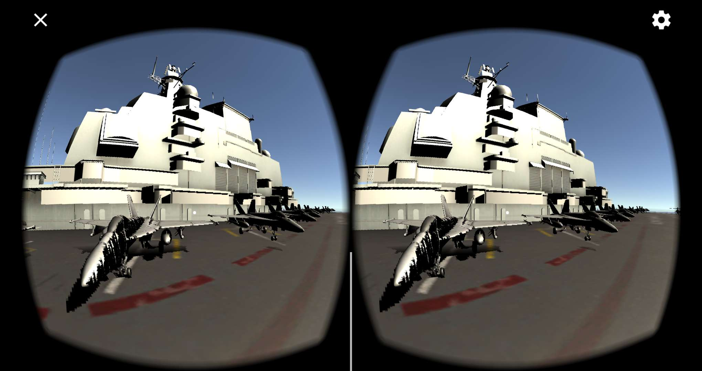

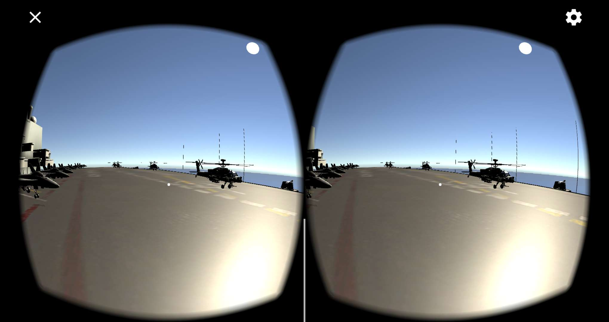

Note that this aircraft carrier is China's Liaoning Hao

Then, click "Start", officially entered the military museum
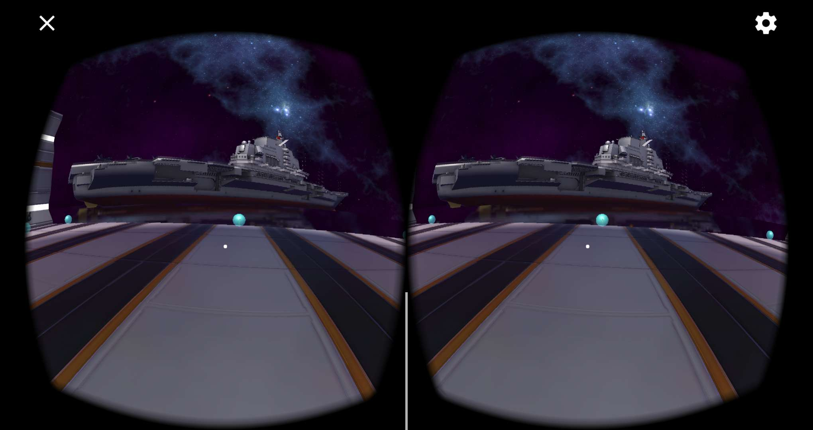

Discovery Museum is in a semi-open seaside, listening to a large maritime aircraft carrier, the room inside to put an armed helicopter, a fighter aircraft, an armored vehicle and a tank

Let's go in and see the aircraft carrier
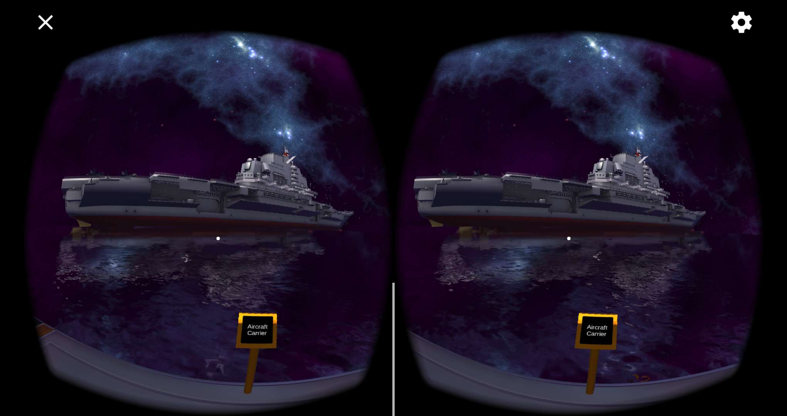

View aircraft carrier details
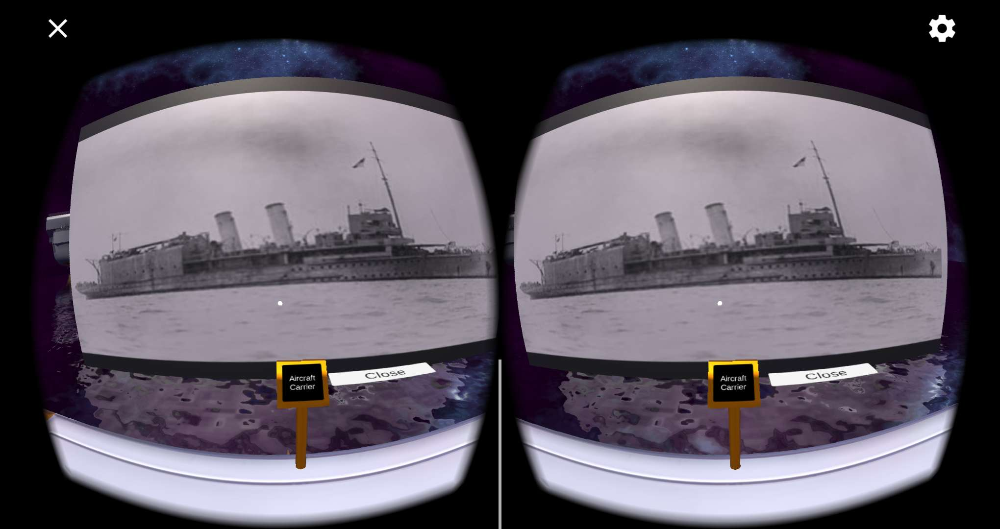

Let's go in again to see the helicopter gunship
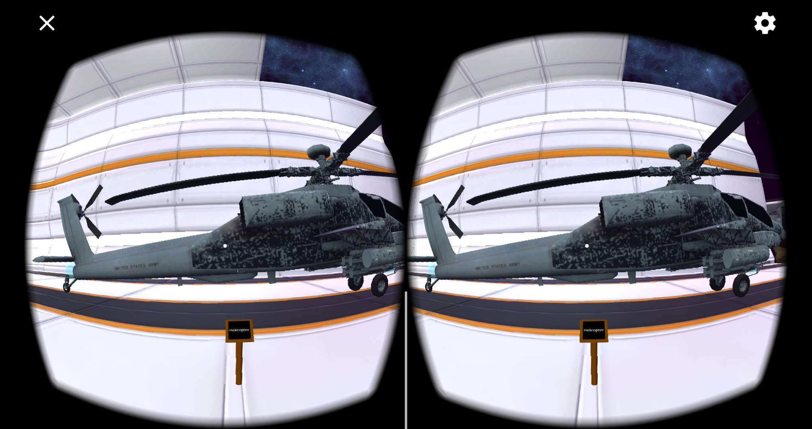

See armed helicopters details
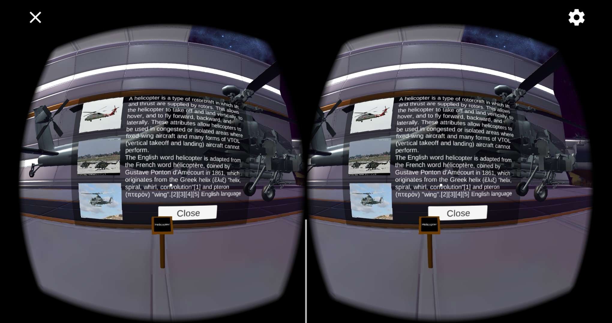

Let's go in and see the fighter
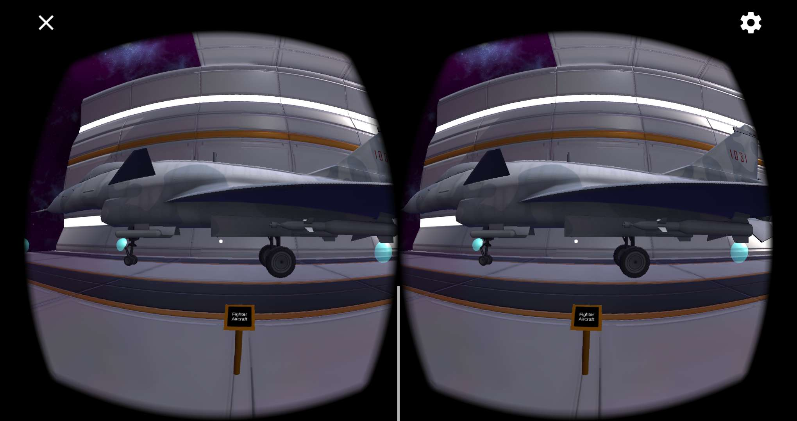

View detailed description of armed fighters
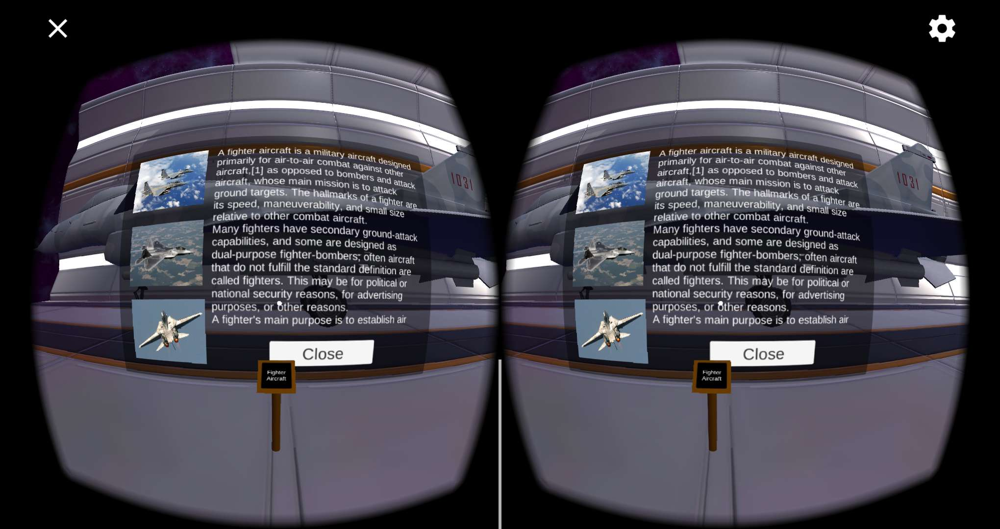

Let's go and look at the armored vehicles
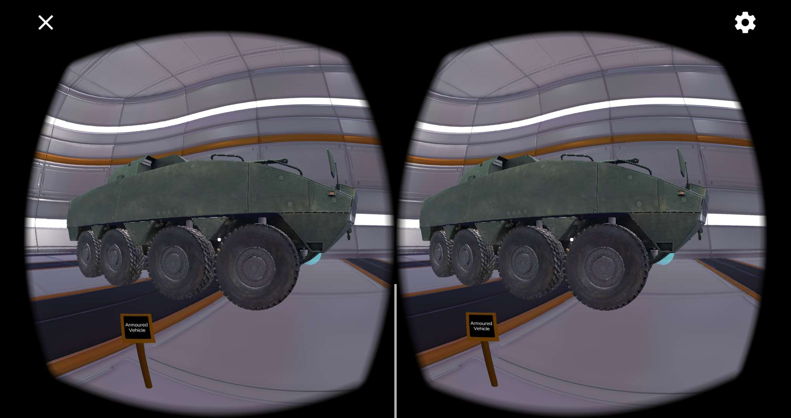

View armored car details
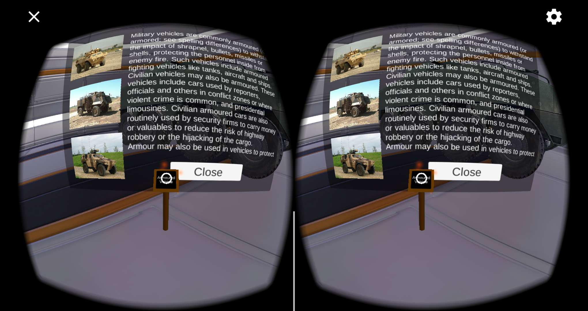

Let's go in and see the tank
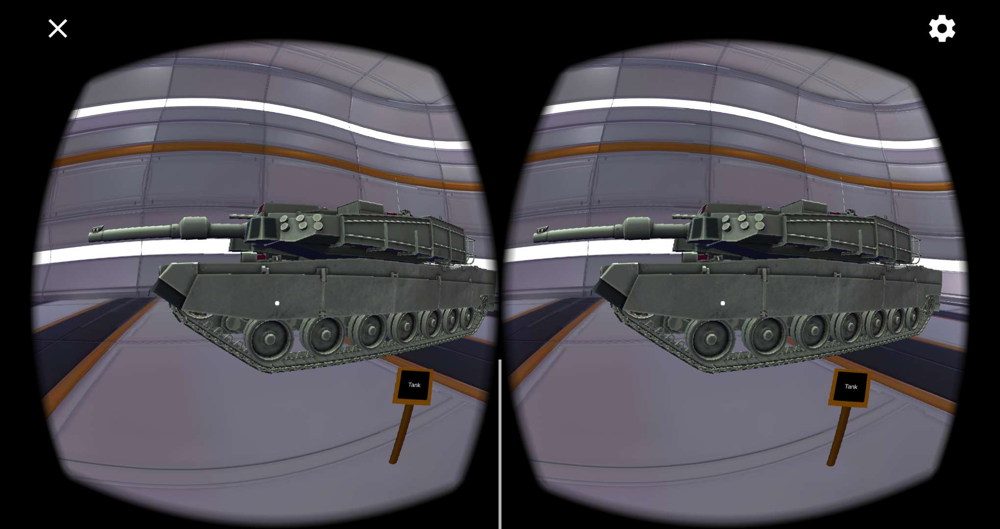

See tank details
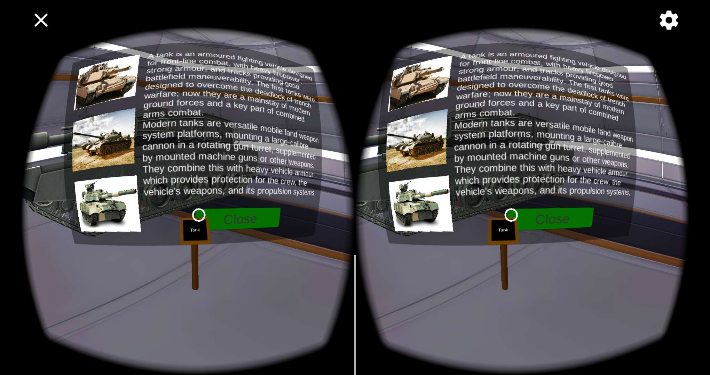

Museum We have visited the end of some balls on the ground is the other observatory, you can go from different angles to visit the Military Museum